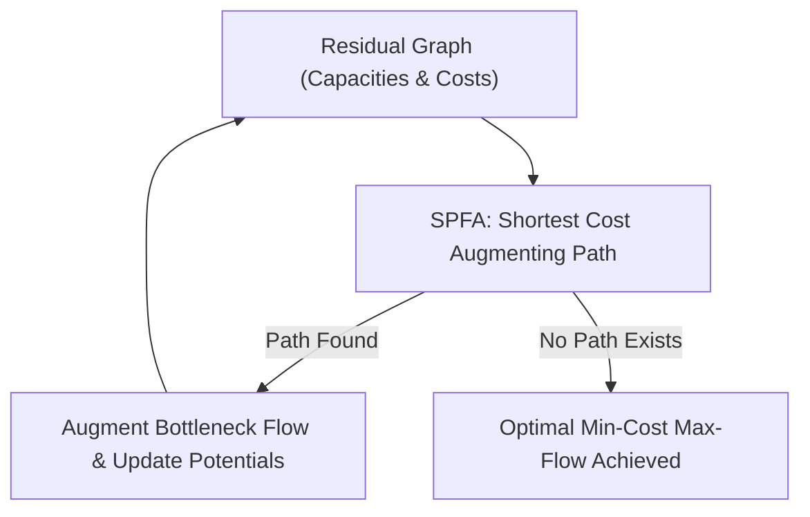

# Min-Cost Max-Flow (MCMF) Skill

High-efficiency, zero-dependency Python implementation of **Minimum-Cost Maximum-Flow (MCMF)** via Successive Shortest Paths and Shortest Path Faster Algorithm (SPFA).

## Features
- **Successive Augmentation**: Repeatedly routes flow along least-cost paths in residual network graphs.
- **Negative Cycle Resilience**: Maintains conservative potential invariants avoiding infinite cycling.
- **Zero External Dependencies**: Pure Python standard library.
- **Native MCP Protocol**: JSON-RPC 2.0 stdio server compatible with Claude Desktop, Cursor, and Windsurf.

## Architecture

